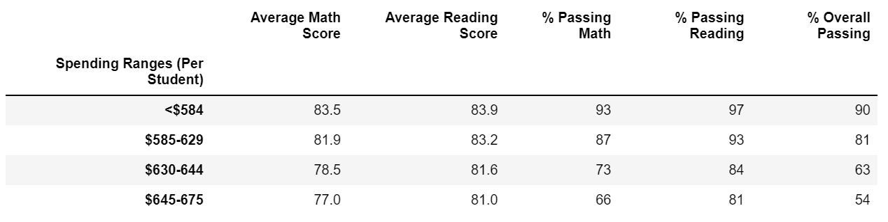

# PyCity Schools Analysis

## Overview

A second analysis of a school district's test scores must be completed after alledged tampering of scores for the Thomas High School's ninth graders. For the analysis, NaNs ("Not a Number") replaced the math and readng grades to remove them from any district analysis. Analysis captured how the district fared by inidividual school, school size, spending per capita, and school type. The new school summaries were compared against the previous calculations. 

## Results
* *How is the district summary affected?* 
The average math and reading scores and the passing rates all decreased slightly. The overall passing rate dropped .1%, while math and reading passing percentages dropped .2% and .3% respectively. 
Previous District Summary:
  
Recalculated District Summary:
 

* *How is the school summary affected?*
The only school affected by the change is Thomas High School.  While the scores are higher in the original report, there is not a significant change.

Previous Thomas High School Summary:

 

Recalculated Thomas High School Summary:

 

* *How does replacing the ninth graders' math and reading scores affect Thomas High School's performance relative to the other schools?*

Thomas High School still ranks 2nd for the Overall Passing percentage. It does not affect the standings. 

* How does replacing the ninth-grade scores afect the following: Math and REading Scores by Grade, Scores by school speding, scores by school size, scores by school type. The changes are so minute that the scores by school spending, school size, and school type aren't phased within the rounding format. 
	* Math and reading scores by grade: In the code, only Thomas High School's 9th grade scores were altered to NaNs. 

	* Scores by school spending - Thomas High School is categorized in the $630-648 range. 

	* Scores by school size - Thomas High School is categorized as Medium. 

	* Scores by school type - Thomas High School is a Charter school.  

## Summary
There are a few key findings from replacing the 9th grade scores. 
1. The amount of change in the overall district summaries could imply that the cheating wasn't as extensive as believed. 
2. In tandem with point #1, since the 9th grade scores were similar to the 10th - 12th grade, and the school summary didn't alter much, the whole school could have been involved in the scandal. 
